## Description of Application
This is a chess game which follow all the basic rules for the moves and all other game bases implemented using C programing language.
The game validate all user inputs however trivial they are as the inputs are not case sensitive and the game also never crashes under any circumstances as I take the user inputs as strings and convert them with in the code to deal with them so any input from the user will do the action he wishes if its validate or wait for another input if not validate. The game autosave everything before each turn so that if the game closed any time the game could continue from last point and also can be undo and redo to the first and last move any time.
The basic idea of the game is making two dimensional array(board[8][8]) which represents the board of the chess and fill it with the pieces from text files (NewGame.txt / Load.txt) and control the movement of these pieces on the board using function for every piece that called by the program when the user chooses one of them to move.
Then I implement other function for the main rules of the chess game to play the game under basic rules like functions for check and checkmate and stalemate and promotion.
After that I implement the functions that saves and load the game.
I prepared the interface of the game and the board to show the pieces in suitable way and show taken pieces from each player. When the game is opened it show the main menu interface from which the user can choose to start new game or load or see the rules and the manuals. After he chooses the board printed on screen on suitable way and beside the board there are two columns each of them is for taken pieces of each player and under these columns there is a plate shows player turn.
Under the board the instructions asked the user for the input and show him the options he has like undo and redo and go back to the main menu. The board updated after each move and prints error messages for invalid inputs.

## How To Download The Game And Start Playing it 
- download Project.exe file and NewGame.txt file in same folder
- open Project.exe and start playing and otjer files will be automatically created for loading and undoing.

## Features Application Provides

The program provides all the basic rules of movement of all pieces and refuse any invalid ones and its user interface is easy for the user to play.
Other features that the game also provides:

 1. Showing available moves for the player on the board and print them under board
2. Check & Checkmate & Stalemate (Including no moves or specials pieces are just remains like only two kings and all other cases)
3. Promaotions
4. Saving and loading while need
5. Undo till the first turn and redo till the last move (even if the game is loaded) and also program provides to undo if the game ended stalemate or checkmate.
6. The board is printed in words instead of letter for easy using.

## Design, Assumptions Made, and Details need to be Clarified

The game main function is a loop which manages the game interface and manages the game flow and the changes of turns.
Inside the loop there are two main functions each one call player (player1 , player2)
Inside each of these two functions all the game happen and all the function are called if needed.
These two main functions return 1 if the player chooses to go back to main menu and returns 0 if the game ended checkmate or stalemate to ask the user for what he want to do (undo or exit).
Inside these functions also the game is saved and all the indexes also.
I sometimes also use some integer indicators through the functions for example indicator to check if there is taken pieces to save them.
There are also some important global variable that I have implemented before the main function such as “temp” which I have used a lot as a place holder if I want to exchange two variables and an array of letter to print them nest to the board and also other important indexes which used through the code.

## Data Structures

The main data structure use in the code is the 2-D array of the chess board (board[8][8]) which is filled with the pieces from text files.

## Important Functions

> void SetColorAndBackground(int ForC, int BackC)

This function takes two integer parameters each one refers to a color in c language. First parameter is for the color of the text in the console and second one is for the background color.
♦This function is used through the code for designing purpose for example coloring the
white squares on the board.

> void printAvailableBoard(int *available)

This function takes a pointer parameter that points at an array of positions which are valid or available for the piece that the player chose.
♦This function is used to print aboard with “#” in the squares of the available moves to make it easy for the users.

> int change(int r1,int c1,int r2,int c2,int*available)

This function takes a pointer parameter that points at an array of positions which are valid or available for the piece that the player chose and also takes four integer parameters of the positions of the piece and the positions that the player wishes to move the piece to.
♦Briefly, this function is responsible for the moving of the piece as it searches for the input of the user in the available array of places for the piece if it is in their it will do the move if not then it will return zero to print invalid input and wait for another input from the user.

> void save()

♦This function is used to save the board, taken pieces from each player, and the moves played through the game for undo and redo, and some other important indexes like the turn of the player turn in text files. And this function is called before each turn.

> void load()

♦This function is used to load the game from last point it has stopped at if the player chooses to load it.
It loads each part of the game even the previous move for undo and redo.

> void newGame()

♦This function prepares the board and all the indexes for a new game.

> int *pawnWhite(int r1,int c1) 
> int *pawnblack(int r1,int c1) 
> int *rook(int r1,int c1)
> int *rookB(int r1,int c1) 
> int *knight(int r1,int c1) 
> int *knightB(int r1,int c1) 
> int *bishop(int r1,int c1) 
> int *bishopB(int r1,int c1) 
> int *queen(int r1,int c1) 
> int *queenB(int r1,int c1) 
> int *king(int r1,int c1) 
> int *kingB(int r1,int c1)

♦Each of these functions takes two integer parameters for the position of its piece and it returns an array of all available moves for this piece and if the piece can’t move it returns array of -1 then the game prints this piece can’t move choose another one.

> int check()       
> int checkB()

♦This function use to check whether the king is under check or not it returns 1 if the king is under check and 0 if not.
It is called before the turn of the player to see if his king is checked and print that on screen to show him and called again after his turn to see if after the move the king is still under check the game will refuse his move and print the king is still checked do another move.

> int checkmate() 
> int checkmateB()

♦This function use to check whether the king is dead and checkmate or not.
It is called before the turn of each the player and it see if the king is under check and there aren’t any move of his pieces can stop this check this its checkmate and the game ended by the winning of other opponent.

> int stalemate() 
> int stalemateB()

♦This function use to check whether the game ended draw or not.
It is called before the turn of each the player and it check many cases of stalemate.
-If it is the player turn and his king is not under check and there is no available moves for any of his pieces.
-If there are only two kings on the board
-If there are only two kings and one knight
-If there are only two kings and one bishop
-If there are only two kings and two bishop one for each player and each bishop is on a same color square.

## User Manual

-First it is better for the user or the player to full screen for better use and to see the whole board without any miss ordering.
-The user could start a new game or resume last game from the main menu interface.
-The player chooses the coordinates of the piece that he wishes to move by typing the letter (capital or small) of the column followed by the number of the row.
Ex. (A2)

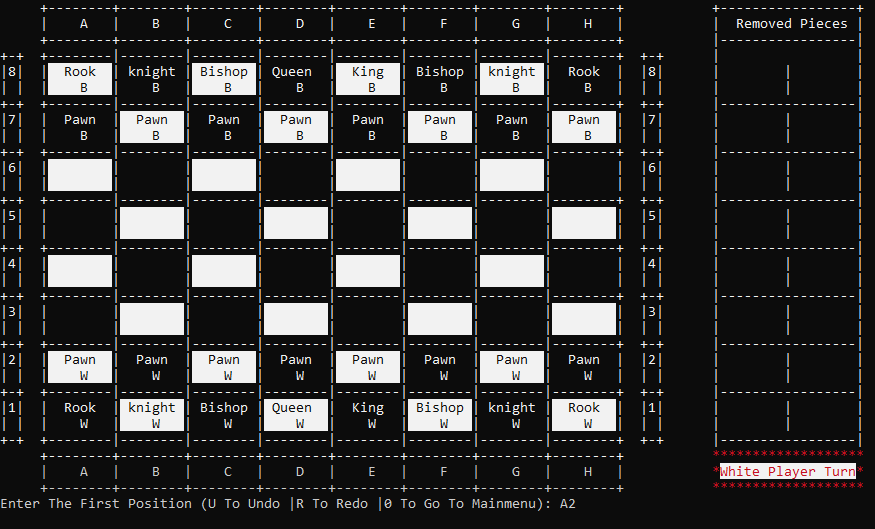

-Then the game shows the available positions for this piece if there is by showing these positions on the board and print them under the board
And then you enter the second position in same way.

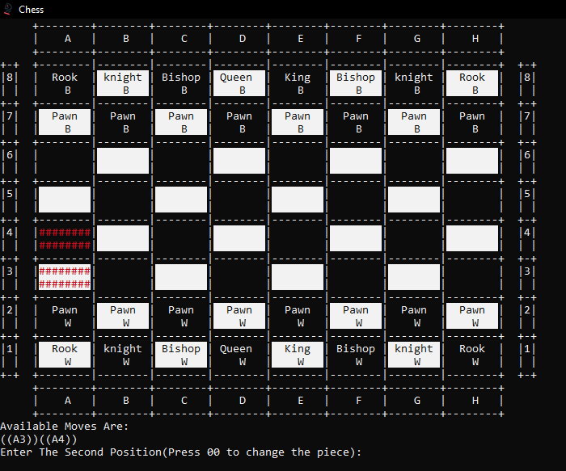

-The game will refuse any trivial input or invalid input that crashes the rules of the game.

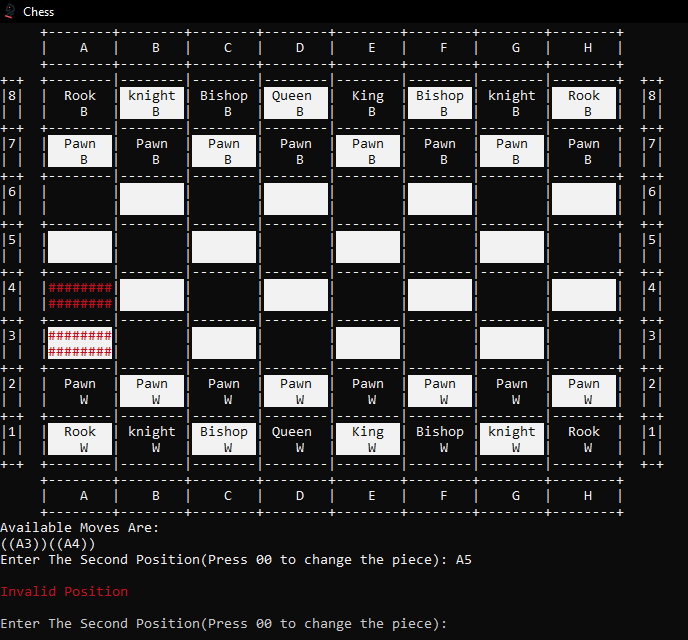

-The player can change the piece he has chosen by enter 00
-The player can undo his move any time by entering U and can redo by entering U and note that the game can undo to the first move.

## Sample Runs
interface

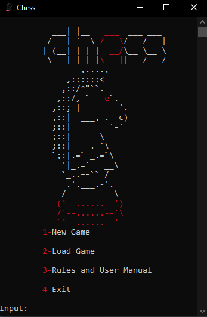

newGame

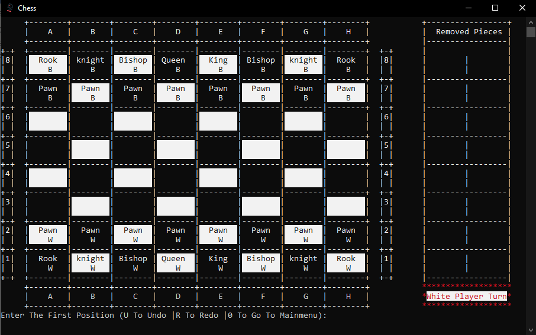

taken out from both players

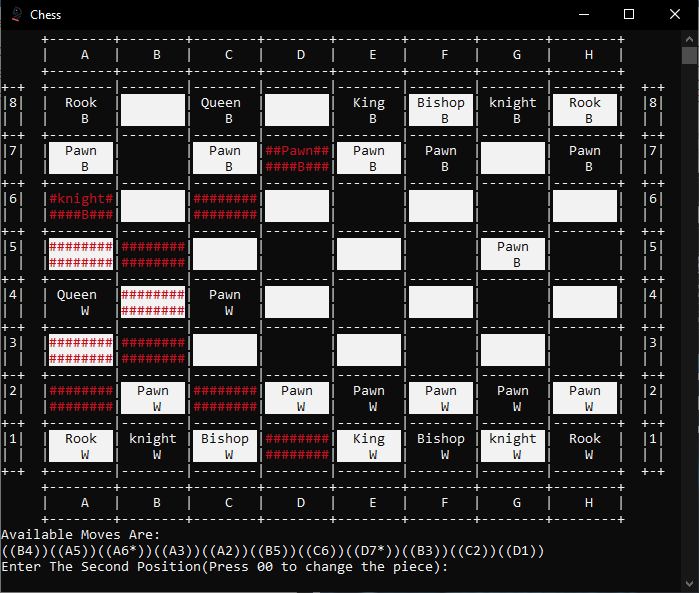

availabe positions for move

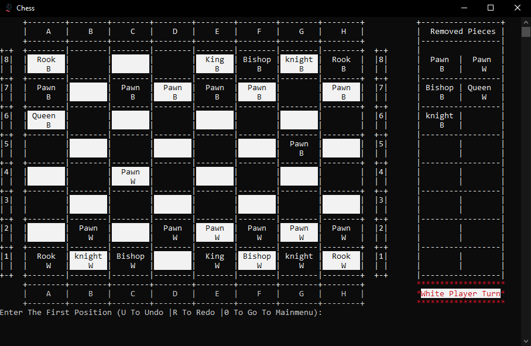

check

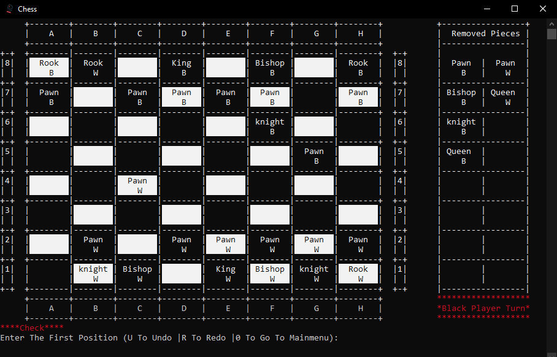

Can’t do move cause king still under check

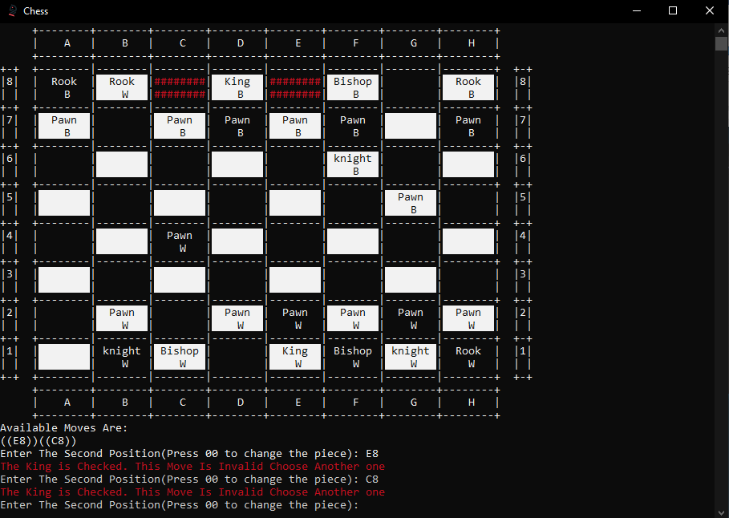

promotion

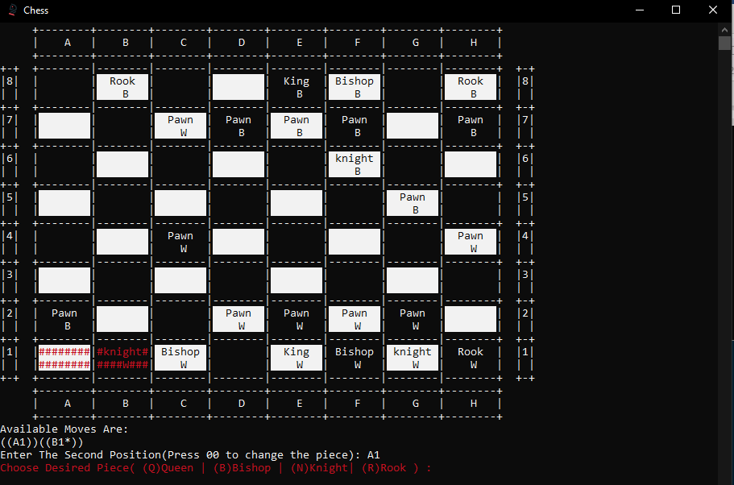

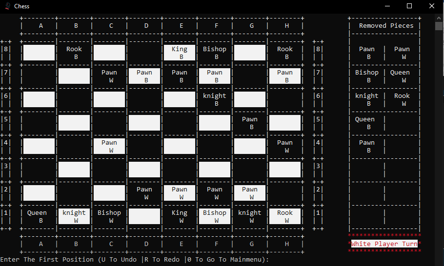

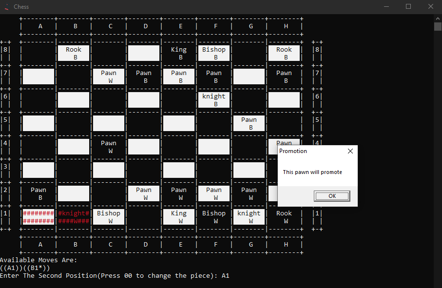

checkmate

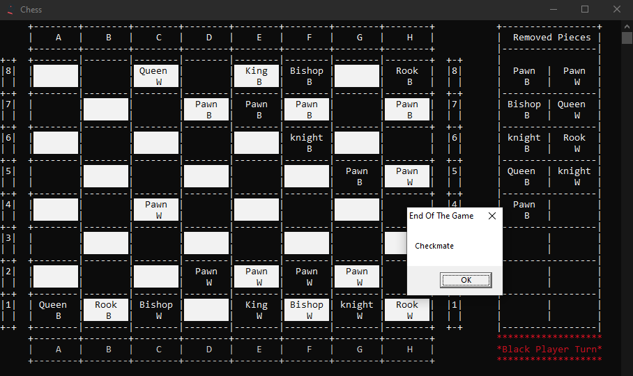

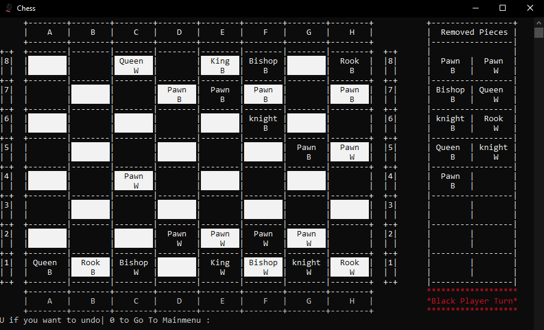

stalemate

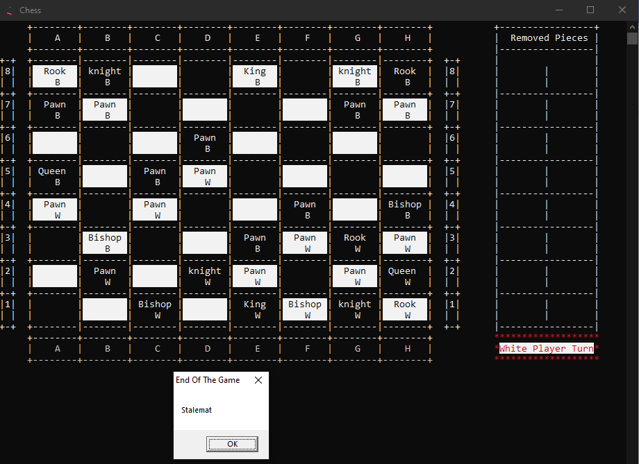

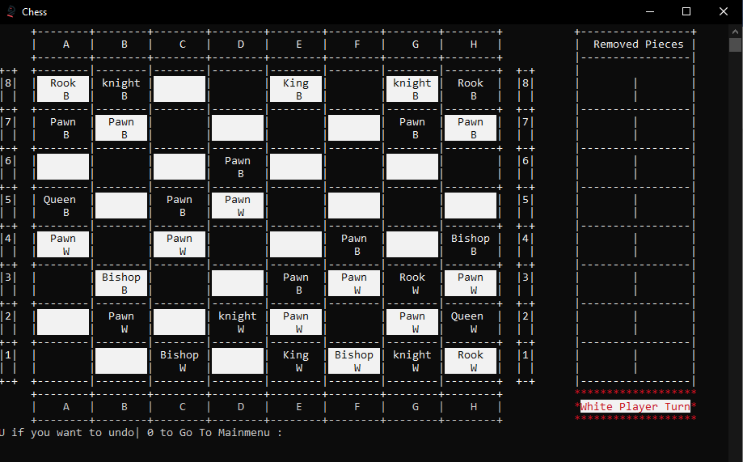

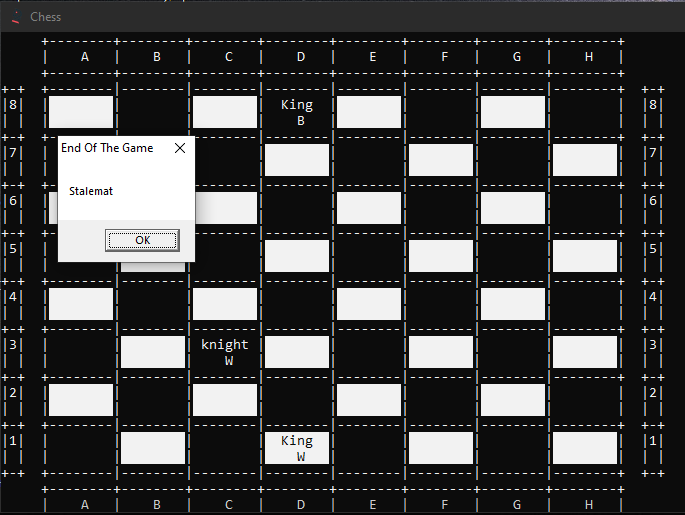

